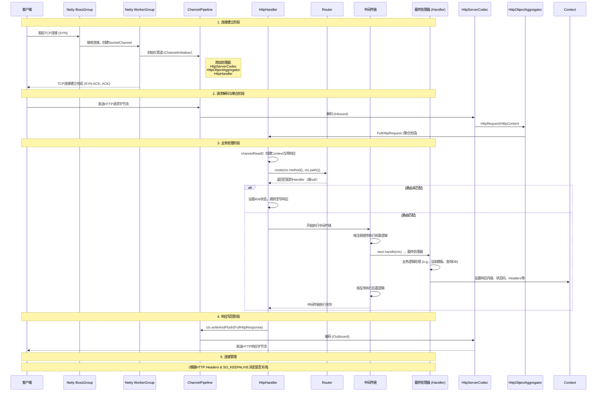

# Jinitamy Web Framework

Jinitamy是一个轻量级的Java Web框架，基于Netty构建，提供简单直观的API。

## 项目结构

项目采用Maven构建，主要包含以下目录结构：
```
├── .gitignore                                      # Git忽略文件配置
├── README.md                                       # 项目说明文档
├── pom.xml                                         # Maven项目配置文件
└── src\                                            # 源代码目录
    ├── main\                                       # 主要代码目录
    │   ├── java\                                   # Java源代码目录
    │   │   └── com\                                # 顶级包名
    │   │       └── jinitamy\                       # 项目主包名
    │   │           ├── core\                       # 核心功能包
    │   │           │   ├── Context.java            # 请求上下文类
    │   │           │   ├── Engine.java             # Web引擎核心类
    │   │           │   ├── Handler.java            # 请求处理器接口
    │   │           │   ├── HttpHandler.java        # HTTP请求处理实现
    │   │           │   ├── Middleware.java         # 中间件接口
    │   │           │   ├── Router.java             # 路由管理类
    │   │           │   └── template\               # 模板引擎子包
    │   │           │       └── TemplateEngine.java # 模板引擎实现
    │   │           └── example\                    # 示例应用包
    │   │               └── ExampleApp.java         # 示例应用入口类
    │   └── resources\                              # 资源文件目录
    │       └── templates\                          # 模板文件目录
    │           └── index.ftl                       # FreeMarker模板文件
    └── test\                                       # 测试代码目录
        └── java\                                   # Java测试代码目录
            └── com\                                # 测试包结构（与主代码对应）
                └── jinitamy\                       # 项目测试包
                    └── core\                       # 核心功能测试包
                        ├── ContextTest.java        # Context类测试
                        ├── EngineTest.java         # Engine类测试
                        ├── HandlerTest.java        # Handler接口测试
                        ├── HttpHandlerTest.java    # HttpHandler类测试
                        ├── MiddlewareTest.java     # Middleware接口测试
                        └── RouterTest.java         # Router类测试
```

核心代码位于`com.jinitamy.core`包下，示例应用位于`com.jinitamy.example`包下。

### 核心组件

1. **Engine**：框架的核心类，负责管理HTTP服务器、路由注册、中间件管理和服务器配置。它基于Netty实现HTTP服务器，提供了简洁的API来注册路由和中间件。

2. **Router**：路由管理器，实现了基于前缀树的路由匹配系统，支持静态路由、动态参数路由（如：/user/:id）和通配符路由（如：/files/*）。路由匹配按优先级进行：静态路由 > 动态参数路由 > 通配符路由。

3. **Context**：HTTP请求上下文，封装了HTTP请求和响应的相关信息，提供统一接口访问请求信息、响应信息、路由参数和自定义属性。

4. **HttpHandler**：HTTP请求处理器，是Netty的ChannelHandler实现，负责接收HTTP请求、路由匹配、中间件链执行、响应发送和异常处理。

5. **Handler**：路由处理器接口，定义了处理HTTP请求的标准方法，使用@FunctionalInterface注解，可以使用Lambda表达式简化实现。

6. **Middleware**：中间件接口，定义了中间件的标准方法，用于实现请求的预处理和后处理逻辑。中间件按添加顺序依次执行。

7. **TemplateEngine**：模板引擎封装类，提供对FreeMarker模板引擎的简单封装，用于服务端渲染。

好的，我们可以根据您提供的详细描述，绘制一个清晰的时序图来展示一个HTTP请求在您项目中的完整生命周期。这个时序图将涵盖从TCP连接建立到响应写回的全过程。

### Jinitamy 框架请求处理时序图



---

#### 图中各步骤的详细说明：

1.  **连接建立阶段 (Connection Establishment)**
    *   客户端发起 TCP 连接（SYN）。
    *   Netty 的 `BossGroup` 接收连接，并将其注册到 `WorkerGroup` 的一个 `EventLoop` 上，创建 `SocketChannel`。
    *   `ChannelInitializer` 被调用，初始化 `ChannelPipeline`，依次添加 `HttpServerCodec`, `HttpObjectAggregator`, 和自定义的 `HttpHandler`。
    *   TCP 三次握手完成，连接建立。

2.  **请求解码与聚合阶段 (Request Decoding & Aggregation)**
    *   客户端通过已建立的连接发送 HTTP 请求字节流。
    *   字节流在 `Pipeline` 中向上游传播，首先由 `HttpServerCodec` 解码为 `HttpRequest` 和多个 `HttpContent` 对象。
    *   `HttpObjectAggregator` 将这些分片的消息聚合成一个完整的 `FullHttpRequest` 对象。
    *   完整的请求对象被传递到 `HttpHandler` 的 `channelRead0` 方法。

3.  **业务处理阶段 (Business Processing)**
    *   `HttpHandler` 创建一个 `Context` 对象，封装了请求、一个预创建的响应对象以及其他元数据。
    *   调用 `Router` 进行路由匹配，根据请求的 Method 和 Path 查找对应的 `Handler`。
    *   **如果未匹配**：设置 404 状态码，直接准备响应。
    *   **如果匹配**：
        *   构建中间件链，链的最内层是匹配到的最终 `Handler`。
        *   开始执行中间件链。每个中间件可以选择执行前置逻辑、调用 `next.handle(ctx)` 继续执行链、执行后置逻辑，或直接短路返回。
        *   最终 `Handler` 执行核心业务逻辑（如数据库操作、模板渲染），并通过 `Context` 对象设置响应内容、状态码和头信息。
        *   中间件链执行完毕后返回。

4.  **响应写回阶段 (Response Write Back)**
    *   `HttpHandler` 将 `Context` 中已经填充好的 `FullHttpResponse` 对象写入 `ChannelPipeline`。
    *   响应对象在 `Pipeline` 中向下游传播，经过 `HttpServerCodec` 被编码为 HTTP 响应字节流。
    *   字节流通过网络发送回客户端。

5.  **连接管理 (Connection Management)**
    *   图中未详细绘制的环节。根据 HTTP 协议（如 `Connection: keep-alive` 头）和 TCP 的 `SO_KEEPALIVE` 设置，决定是关闭连接还是保持连接以等待下一个请求。

#### 异常处理路径：
*   如果在**阶段 2、3、4**中发生异常（如聚合大小超限、中间件或处理器抛出异常），异常会被 `HttpHandler` 的 `exceptionCaught` 或 `channelRead0` 中的 try-catch 块捕获。
*   捕获后，会尝试设置一个 500 错误的响应并写回客户端。
*   如果是严重的通道级异常，则会记录错误并关闭 `Channel`。

这个时序图清晰地展示了一个请求在您框架中“一生”所经历的关键环节和组件交互，与您的详细描述完全吻合。

### 技术栈

- **Java 17**：项目使用Java 17作为编译目标。
- **Netty 4.1.94**：作为底层网络框架，处理HTTP请求和响应。
- **SLF4J 2.0.9 + Logback 1.4.11**：用于日志记录。
- **JUnit 5.10.0**：用于单元测试。
- **FreeMarker 2.3.32**：用于模板渲染。


## 快速开始

### 添加依赖

```xml
<dependency>
    <groupId>com.jinitamy</groupId>
    <artifactId>jinitamy</artifactId>
    <version>1.0-SNAPSHOT</version>
</dependency>
```

### 创建应用

```java
import com.jinitamy.core.Engine;
import io.netty.buffer.Unpooled;
import io.netty.handler.codec.http.HttpHeaderNames;
import io.netty.handler.codec.http.HttpHeaderValues;
import java.nio.charset.StandardCharsets;

public class App {
    public static void main(String[] args) throws Exception {
        Engine engine = new Engine();
        
        // 添加路由
        engine.get("/", ctx -> {
            String resp = "Hello, Jinitamy!";
            ctx.getResponse().headers()
                    .set(HttpHeaderNames.CONTENT_TYPE, HttpHeaderValues.TEXT_PLAIN)
                    .set(HttpHeaderNames.CONTENT_LENGTH, resp.length());
            ctx.getResponse().content().writeBytes(Unpooled.copiedBuffer(resp, StandardCharsets.UTF_8));
        });
        
        // 启动服务器
        engine.setPort(8080);
        engine.start();
    }
}
```

### 动态路由

```java
engine.get("/hello/:name", ctx -> {
    String name = ctx.getParam("name");
    if (name == null || name.trim().isEmpty()) {
        ctx.status(400);
        String errorResp = "Bad Request: name parameter is required";
        ctx.getResponse().headers()
                .set(HttpHeaderNames.CONTENT_TYPE, HttpHeaderValues.TEXT_PLAIN)
                .set(HttpHeaderNames.CONTENT_LENGTH, errorResp.length());
        ctx.getResponse().content().writeBytes(Unpooled.copiedBuffer(errorResp, StandardCharsets.UTF_8));
        return;
    }
    
    String resp = "Hello, " + name + "!";
    ctx.getResponse().headers()
            .set(HttpHeaderNames.CONTENT_TYPE, HttpHeaderValues.TEXT_PLAIN)
            .set(HttpHeaderNames.CONTENT_LENGTH, resp.length());
    ctx.getResponse().content().writeBytes(Unpooled.copiedBuffer(resp, StandardCharsets.UTF_8));
});
```

### 使用模板引擎

1. 创建模板文件 (src/main/resources/templates/index.ftl):

```html
<!DOCTYPE html>
<html>
<head>
    <title>${title}</title>
</head>
<body>
    <h1>${title}</h1>
    <div class="content">
        ${content}
    </div>
</body>
</html>
```

2. 在路由中使用模板：

```java
import com.jinitamy.core.template.TemplateEngine;
import io.netty.buffer.Unpooled;
import io.netty.handler.codec.http.HttpHeaderNames;
import io.netty.handler.codec.http.HttpHeaderValues;
import java.nio.charset.StandardCharsets;
import java.util.HashMap;
import java.util.Map;

engine.get("/", ctx -> {
    Map<String, Object> model = new HashMap<>();
    model.put("title", "欢迎页面");
    model.put("content", "这是使用模板引擎渲染的内容");
    
    String html = TemplateEngine.render("index.ftl", model);
    ctx.getResponse().headers()
            .set(HttpHeaderNames.CONTENT_TYPE, HttpHeaderValues.TEXT_HTML)
            .set(HttpHeaderNames.CONTENT_LENGTH, html.length());
    ctx.getResponse().content().writeBytes(Unpooled.copiedBuffer(html, StandardCharsets.UTF_8));
});
```

### 添加中间件

```java
engine.use((ctx, next) -> {
    long start = System.currentTimeMillis();
    System.out.printf("[%s] %s\n", ctx.getMethod(), ctx.getPath());
    try {
        next.handle(ctx);
    } catch (Exception e) {
        System.err.println("Error processing request: " + e.getMessage());
        ctx.status(500);
    }
    System.out.printf("Time: %dms\n", System.currentTimeMillis() - start);
});
```

## 项目依赖

- Netty 4.1.94.Final - 网络应用框架
- FreeMarker 2.3.32 - 模板引擎
- SLF4J 2.0.9 - 日志门面
- Logback 1.4.11 - 日志实现
- JUnit Jupiter 5.10.0 - 测试框架

## 构建项目

```bash
mvn clean package
```

## 运行示例

### 方法1：直接运行主类
```bash
mvn exec:java -Dexec.mainClass="com.jinitamy.example.ExampleApp"
```

### 方法2：编译后运行
```bash
mvn compile
java -cp target/classes com.jinitamy.example.ExampleApp
```

## 目录结构

```
src/
├── main/
│   ├── java/
│   │   └── com/
│   │       └── jinitamy/
│   │           ├── core/
│   │           │   ├── Engine.java
│   │           │   ├── Router.java
│   │           │   ├── Context.java
│   │           │   ├── Handler.java
│   │           │   ├── Middleware.java
│   │           │   ├── HttpHandler.java
│   │           │   └── template/
│   │           │       └── TemplateEngine.java
│   │           └── example/
│   │               └── ExampleApp.java
│   └── resources/
│       └── templates/
│           └── index.ftl
└── test/
    └── java/
        └── com/
            └── jinitamy/
                └── core/
                    ├── RouterTest.java
                    ├── ContextTest.java
                    └── ...
```

## 许可证

MIT License 